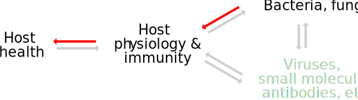

# Why am I here

- I did my PhD at MIT with Eric Alm
- Dr. Brito ("Ilana") was a close mentor and squash partner
- Dr. Duvallet ("Claire") was a fellow PhD student
- OpenBiome is cool

# My goals for today

I want to point you toward:

- Some particular questions in the microbiome
- Some data types and experimental models
- OpenBiome's work and philosophy

---

# Somewhere in 2012 (or, the Birth of OpenBiome)

- I was a grad student working on environmental microbiology projects
- Mark Smith (above) starting bringing some non-grad-students around the lab

# *C. difficile* is a major public health threat

- It is the most common hospital-acquired infection, affecting 500,000 Americans yearly
- 20% do not respond to antibiotics, and 30,000 die

cdc.gov/cdiff

# Fecal microbiota transplant (FMT) can cure most recurrent *C. diff*

> What are the best treatments for recurrent CDI? 
> ... 
> [FMT] is recommended for patients with multiple recurrences of CDI who have failed appropriate antibiotic treatments...

{ width=30% }

https://www.idsociety.org/practice-guideline/clostridium-difficile

# OpenBiome started because a family member couldn't get FMT

> In 2011, a close friend [...] contracted a *C. difficile* infection after a
> routine surgery, and antibiotic treatment wasn't working. For 18 months, we
> watched him suffer with this debilitating illness and several rounds of
> failed treatment. [...] he sought but couldn't find a clinician who could
> perform [FMT] for him.  When he finally received a [self-administered]
> life-changing fecal transplant, the effect was remarkable. Within a couple of
> days he had his life back.

https://www.openbiome.org/about

# OpenBiome bootstrapped, from humble beginnings

- 2013: Shipped ~100s of treatments using ~1 technician
- 2014: Shipped 1,800 treatments to 170 clinical partners
- 2015: Shipped 7,000 treatments to 520 clinical partners (10% of all recurrent *C. diff* patients)
- 2016: I graduated from MIT and stopped thinking about OpenBiome

---

Garrett J Cell Biol 2015

# A schematic for microbiome science and practice

# Application areas ("R-groups") in the microbiome

- "Microbiome" means connecting to human *host health* and *host physiology/immunity*
- Non-human microbiome means different hosts
- (Old school) microbial ecology means connecting to the *environment*
- Agriculture means connecting to *plant health and physiology*

# This schema helps visualize different activities in microbiome science

**Probiotic therapy**

# This schema helps visualize different activities in microbiome science

**Prebiotic therapy**

# This schema helps visualize different activities in microbiome science

**FMT**

# This schema helps visualize different activities in microbiome science

**Diagnostics** (e.g., wastewater epidemiology)

# Know which way your arrows point to avoid confusion and useless work

- A microbiome *diagnostic* predicts or classifies disease. But is there an easier source of data?
- A microbiome *therapy* treats a disease. How could it be tested?
- A search for a microbiome *mechanism* means you haven't committed to either direction.

# {data-background="img/deepwater.jpeg"}

# Oil-degrading microbes were unexpected parnters after Deepwater Horizon

- Of spilled Deepwater Horizon oil, humans cleaned up 25% and microbes cleaned up 50%
- Will oil clean up "on its own" when spilled in other places?
- Could we use oil-degrading microbes intentionally?

# A simple experiment was designed to identify oil-degrading bacteria

# A simple experiment was designed to identify oil-degrading bacteria

# 16S ribosomal RNA is a tool for characterizing the composition of a bacterial community

{ width=75% }

# 16S and simple analytical method identified those oil degraders

{ width=45% }

Olesen PLOS One 2016

# {data-background="img/salt.jpg"}

# Salt is known to affect blood pressure

# Does salt affect blood pressure via the microbiome?

# A simple experiment was designed to identify salt-sensitive microbes

{ width=75% }

# Machine learning identified bacteria that differed between the two diets

{ width=40% }

Wilck Nature 2017

# Replacing the missing microbe alleviated salt-induced high blood pressure

Wilck Nature 2017

---

One postdoc (on the epidemiology of AMR) later...

---

2019 edition

# OpenBiome is a nonprofit stool bank

Our dual mission is to:

1. Expand safe access to FMT
1. Catalyze research into the microbiome

# OpenBiome's main work is supplying FMT material to treat *C. diff*

- Since founding, we've shipped **46,000** treatment units to 1,200 partners
- Reports from our clinical partners report an efficacy of **80--90%**, comparable to randomized controlled trials
- Our primary goal is to expand safe access to FMT, so we charge the lowest price we can

# FMT for *C. diff* is in a very unusual regulatory situation

- The FDA regulates FMT as a "biologic product", i.e., like a drug, not like a transplant
- (Early practitioners changed the name from "fecal bacteriotherapy" to "transplant" hoping to avoid this situation!)
- To use an unapproved drug, a doctor must fill out an *investigational new drug* (IND) application
- *But* FMT for recurrent *C. diff* does not require an IND

# We expand *safe* access to FMT

- Only **3%** of people who apply to be stool donors pass the logistical, clinical, and laboratory screens.
- We want to avoid known transmissible diseases (e.g., hepatitis) and possible transmissible diseases (e.g., obesity)
- Of 46,000 treatments, we have had **zero** reports of serious adverse definitely related to the FMT material itself

# Universal stool banking has tremendous economies of scale

The alternative is using a new donor for each patient, and having the doctor process the stool.

If 3% of donors pass the test, you need to ask 33 people to get tested before you find a match!

# Also, we can apply high quality standards

# A stool bank can also catalyze FMT research

OpenBiome provides FMT material to clinical researchers for dozens of clinical trials for dozens of indications:

*C. diff*, inflammatory bowel diseases, obesity, hepatic encephalopathy, Sjogren's syndrome, &c. &c.

# We're starting to understand some things about the mechanism of FMT

{ width=75% }

Smillie Cell Host Microbe 2018

# We're starting to understand some things about the mechanism of FMT

{ width=60% }

Smillie Cell Host Microbe 2018

# But, FMT's basic mechanism remains a matter of hypothesis

{ width=50% }

Ott Gastroenterol 2017

# For some, not having the full picture means we should stop doing FMTs

> Dr. Jeffrey I. Gordon of Washington University in St. Louis, [...] urged
> caution. He wants to figure out which bacteria are responsible [for
> FMT-transmissible leanness] so that, eventually, people can be given pure
> mixtures of bacteria instead of feces. Or, even better, learn what the
> bacteria produce that induces thinness and give that as a treatment.

NYT (Sep 5, 2013)

# And for-profit microbiome companies are filling that gap

<table>
<tr>
<td> { width=250px } </td>
<td> { width=250px } </td>
<td> { width=250px } </td>
<td> { width=250px } </td>
</tr>
</table>

> [Vedanta drug candidate] VE303 is a rationally-defined bacterial consortium
> candidate being developed for the prevention of recurrent *C. difficile*
> infection.

# Compiling data from across clinical trials *might* give us a better picture

Olesen Nat Rev Gastro Hepatol 2018

# OpenBiome would be in a unique place to enable such a meta-analysis

# Even without knowing mechanism, we'd rather take the bet

We'd rather put in the haystack (FMT), hoping there's a needle (the "active ingredient"), rather than wait to find the needle.

What if FMT *does* work for something else, and we just didn't try?

# Especially because some conditions are unlikely to get for-profit attention

{ width=50% }

Blanton Science 2016

# Other conditions won't get attention until there's microbiome evidence

- A 6-year old girl got leukemia
- Her leukemia was treated with a bone marrow transplant
- The transplant led her immune system to attack her GI tract (graft-versus-host disease, GvHD)
- After every therapy was exhausted, and this girl was near death, her doctor applied for a single-patient IND
- After FMT, her doctor says it's hard to believe it's the same child; her recovery was so complete

# So we use profits from *C. diff* sales to run OpenBiome-sponsored trials

Work in drug-resistance organism carriage is winding up.

New work in **severe actue malnutrition** and **typhoid carriage** is just beginning.

The only FMT trial in Africa is OpenBiome's malnutrition trial.

# Concluding Zen *ko'an* : Is stool like blood?

- Does it make sense to wait for a defined cocktail? Will it work?
- Blood is the constant counterexample. It's 100 years since we discovered blood groups, and **we still have no blood substitute**.

# Aside: "Sterile fecal filtrate" is my favorite microbiome mystery

> We investigated whether sterile fecal filtrates (containing bacterial debris,
> proteins, antimicrobial compounds, metabolic products, and
> oligonucleotides/DNA), rather than intact microorganisms, are effective in
> patients with CDI.

> In all 5 patients, [fecal filtrate transfer] restored normal stool habits and
> eliminated symptoms of CDI for a minimum period of 6 months.

# Aside: Donor effects are my second-favorite microbiome mystery

{ width=50% }
{ width=50% }
{ width=50% }
